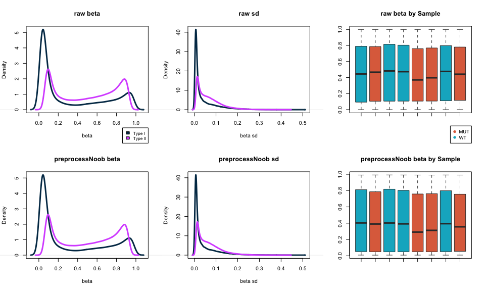
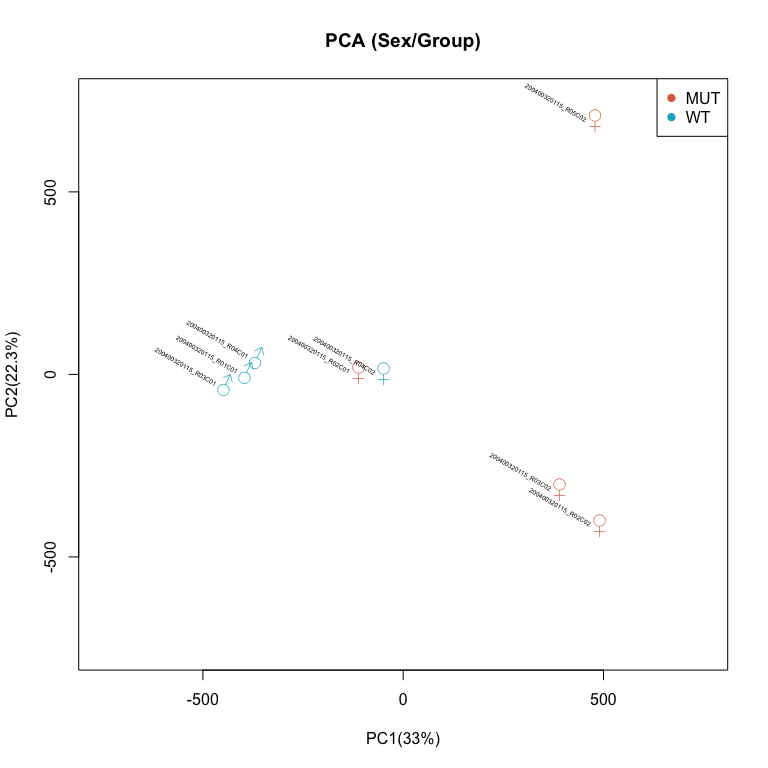
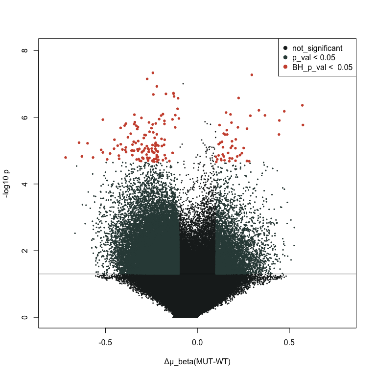

# DNA methylation analysis (Illumina)

*This project is related to the course of DNA/RNA Dynamics of the MSc in Bioinformatics - University of Bologna.*

## Introduction


Welcome to the DNA Methylation Analysis Pipeline for Infinium Data repository! This pipeline is designed to facilitate the analysis of DNA methylation data generated from the Illumina HumanMethylation450 BeadChip platform. The Infinium assay is widely used for studying DNA methylation patterns at a genome-wide scale, providing valuable insights into various biological processes and disease mechanisms.

This repository aims to provide a comprehensive and user-friendly pipeline for processing, analyzing, and interpreting DNA methylation data obtained from the Infinium platform.

### Workflow

* Quality control: Perform data quality assessment to identify any potential issues or biases in the raw data.
* Preprocessing: Apply normalization techniques to minimize technical variations and batch effects within and across samples.
* Differential methylation analysis: Identify differentially methylated regions (DMRs) or individual CpG sites associated with various conditions or phenotypes of interest.
Functional interpretation: Perform functional enrichment analysis to gain insights into the biological processes and pathways related to the identified DMRs.
Visualization: Generate informative plots and figures to visualize the DNA methylation patterns and differential methylation results.

## Installation and Dependencies
To use this pipeline, you will need to have the following R packages installed:

```r


# BiocManager
if (!require("BiocManager", quietly = TRUE))
    install.packages("BiocManager")
BiocManager::install(version = "3.10")

# minfi
BiocManager::install("minfi")

# Illumina manifest
BiocManager::install("IlluminaHumanMethylation450kmanifest")
BiocManager::install("IlluminaHumanMethylation450kanno.ilmn12.hg19")

# factoextra
install.packages("factoextra")

# qqman
install.packages("qqman")

# gplots
install.packages("gplots")

# future.apply (optional for parallelization)
install.packages("future.apply")

# viridis
install.packages("viridis")
```
### Infinium HumanMethylation450K Manifest file
In some steps it is needed to check the Manifest file, which can be found on the [Illumina website](http://support.illumina.com/array/array_kits/infinium_humanmethylation450_beadchip_kit/downloads.html). The manifest was then cleaned, by removing the control and the rs probes.

-> [Rmd_file](DNA_meth_Illumina.Rmd)

## R_pipeline

- <a href="#1-load-raw-data" id="toc-1-load-raw-data">1. Load raw data</a>
- <a href="#2-create-rg-dataframes" id="toc-2-create-rg-dataframes">2.
  Create R/G dataframes</a>
- <a href="#3-get-probe-info" id="toc-3-get-probe-info">3. Get probe
  info</a>
- <a href="#4-create-the-object-mset" id="toc-4-create-the-object-mset">4.
  Create the object MSet</a>
- <a href="#5-qc" id="toc-5-qc">5. QC</a>
- <a href="#6-beta-and-m-values" id="toc-6-beta-and-m-values">6. Beta and
  M-values</a>
- <a href="#7-normalization" id="toc-7-normalization">7. Normalization</a>
- <a href="#8-pca" id="toc-8-pca">8. PCA</a>
- <a href="#9-differentially-methylated-probes"
  id="toc-9-differentially-methylated-probes">9. Differentially methylated
  probes</a>
- <a href="#10-multiple-test-correction"
  id="toc-10-multiple-test-correction">10. Multiple test correction</a>
- <a href="#11-volcano-and-manhattan-plot"
  id="toc-11-volcano-and-manhattan-plot">11. Volcano and Manhattan
  plot</a>
- <a href="#12-heatmap" id="toc-12-heatmap">12. Heatmap</a>

------------------------------------------------------------------------

## 1. Load raw data

Load raw data with minfi and create an object called RGset containing
fluorescence data of R and G channels

``` r
rm(list=ls())
library(minfi)
setwd('/Users/marius/prj/unibo/DRD/R/prj/')
baseDir <- ("Input/")
targets <- read.metharray.sheet(baseDir)
```

    ## [1] "Input//Samplesheet_report_2023.csv"

``` r
RGset <- read.metharray.exp(targets = targets)
```

## 2. Create R/G dataframes

Create the dataframes *Red* and *Green* to store the red and green
fluorescences respectively

``` r
Red <- data.frame(getRed(RGset))
head(Red)
```

    ##          X200400320115_R01C01 X200400320115_R02C01 X200400320115_R03C01
    ## 10600313                  591                  742                  613
    ## 10600322                 4140                 4154                 4553
    ## 10600328                 6535                 6250                 6223
    ## 10600336                15752                15110                16277
    ## 10600345                  597                 1027                  624
    ## 10600353                 1464                 1381                 1863
    ##          X200400320115_R04C01 X200400320115_R02C02 X200400320115_R03C02
    ## 10600313                  577                  592                  637
    ## 10600322                 3965                 3248                 3933
    ## 10600328                 6208                 6154                 6301
    ## 10600336                15746                13907                15217
    ## 10600345                  742                  529                  458
    ## 10600353                 1593                 1591                 1584
    ##          X200400320115_R04C02 X200400320115_R05C02
    ## 10600313                  812                  700
    ## 10600322                 5749                 7030
    ## 10600328                 6129                 5731
    ## 10600336                14955                15061
    ## 10600345                 1674                  393
    ## 10600353                 1649                 1237

``` r
Green <- data.frame(getGreen(RGset))
head(Green)
```

    ##          X200400320115_R01C01 X200400320115_R02C01 X200400320115_R03C01
    ## 10600313                  289                  390                  408
    ## 10600322                 7070                 9820                 9225
    ## 10600328                 6421                 7184                 6963
    ## 10600336                 1571                 1467                 1526
    ## 10600345                 5692                 6353                 7518
    ## 10600353                 4280                 4824                 5346
    ##          X200400320115_R04C01 X200400320115_R02C02 X200400320115_R03C02
    ## 10600313                  360                  337                  431
    ## 10600322                 8324                 8910                 9553
    ## 10600328                 7171                 6836                 6522
    ## 10600336                 1864                 1620                 1496
    ## 10600345                 6360                 6418                 6805
    ## 10600353                 4373                 5110                 4774
    ##          X200400320115_R04C02 X200400320115_R05C02
    ## 10600313                  428                  379
    ## 10600322                 7285                 7154
    ## 10600328                 7554                 6933
    ## 10600336                 1602                 3729
    ## 10600345                 6566                 4261
    ## 10600353                 5290                 4087

## 3. Get probe info

Get the Red and Green fluorescences for the address: **10737353**, and
check in the manifest file if the address corresponds to a Type I or a
Type II probe.

``` r
probe_red <- Red[rownames(Red)=="10737353",]
probe_green <- Green[rownames(Green)=="10737353",]
load('Illumina450Manifest_clean.RData')
Illumina450Manifest_clean[Illumina450Manifest_clean$AddressA_ID=="10737353", 'Infinium_Design_Type']
```

    ## [1] II
    ## Levels: I II

``` r
address_df=data.frame(Sample=colnames(probe_green), Red=unlist(probe_red, use.names = FALSE), Green=unlist(probe_green, use.names = FALSE),Type='II',Color='both')
address_df
```

    ##                 Sample  Red Green Type Color
    ## 1 X200400320115_R01C01 4732  2234   II  both
    ## 2 X200400320115_R02C01 4508  3190   II  both
    ## 3 X200400320115_R03C01 4975  2711   II  both
    ## 4 X200400320115_R04C01 4178  2498   II  both
    ## 5 X200400320115_R02C02 3140   800   II  both
    ## 6 X200400320115_R03C02 2671  1597   II  both
    ## 7 X200400320115_R04C02 4184  2824   II  both
    ## 8 X200400320115_R05C02 1733  1401   II  both

## 4. Create the object MSet

``` r
MSet.raw <- preprocessRaw(RGset)
dim(MSet.raw)
```

    ## [1] 485512      8

## 5. QC

### 5.1 QCPlot

In a QCplot, the medians from the methylation signal and unmethylation
signal distributions are plotted. Data of good quality are found at high
values of median for both the methylated and unmethylated signals; at
contrary, low values of median indicate a lower quality of data.

Two limitations of the QC plot:

- Not taking into account the background signal
- Not taking into account whether some failure happens during the sample
  preparation: you still have high signal but it can be evaluated using
  control probes

``` r
qc <- getQC(MSet.raw)
plotQC(qc)
```


*In the QCplot is clear that all the samples have a good median for both
methylated and unmethylated signals*

### 5.2 Negative controls

Check the intensity of **negative controls** (log intensity should be
lower than 10). Illumina suggests a range of 100-1000 intensity units.
Over 1000 the sample is affected by some issues, for example it’s likely
that the original DNA was degraded, with a loss of specificity.

``` r
controlStripPlot(RGset, controls="NEGATIVE")
```


*In both Green and Red channels the log intensities of negative controls
are below 10, thus the background signal is in the acceptable range.*

### 5.3 Detection P val

Check how many probes have a detection p-value higher than 0.05
(**failed probes**). These probes shows a signal m+u not significantly
higher than the background signal, thus they should be considered as bad
probes.

``` r
detP <- detectionP(RGset) 
failed <- detP>0.05
n_failed=colSums(failed)
summary_df <- data.frame(Sample=colnames(failed),Num_failed_position=n_failed,percentage=colMeans(failed)*100,row.names = NULL)
summary_df
```

    ##                Sample Num_failed_position  percentage
    ## 1 200400320115_R01C01                  45 0.009268566
    ## 2 200400320115_R02C01                  26 0.005355171
    ## 3 200400320115_R03C01                  28 0.005767108
    ## 4 200400320115_R04C01                  32 0.006590980
    ## 5 200400320115_R02C02                 190 0.039133945
    ## 6 200400320115_R03C02                 130 0.026775857
    ## 7 200400320115_R04C02                  17 0.003501458
    ## 8 200400320115_R05C02                 406 0.083623062

*All samples has a percentage of failed probes lower than 1%, so we can
keep all of them. (It would be an option to filter in only the probes
failed in less than a certain percentage of samples.)*

## 6. Beta and M-values

Calculate raw beta and M values and plot the densities of mean
methylation values, dividing the samples in WT and MUT. Check
differences between the 2 groups.

``` r
wt <- targets[targets$Group=="WT", "Basename"]
mt <- targets[targets$Group=="MUT", "Basename"]
wt <- gsub(baseDir, "", wt) 
mt <- gsub(baseDir, "", mt) 

wt_subset <- MSet.raw[,colnames(MSet.raw) %in% wt]
mt_subset <- MSet.raw[,colnames(MSet.raw) %in% mt]

wtBeta <- getBeta(wt_subset)
wtM <- getM(wt_subset)
mtBeta <- getBeta(mt_subset)
mtM <- getM(mt_subset)

density_wtBeta <- density(apply(wtBeta,MARGIN=1,mean,na.rm=T),na.rm=T)
density_mtBeta <- density(apply(mtBeta,MARGIN=1,mean,na.rm=T),na.rm=T)
density_wtM <- density(apply(wtM,MARGIN=1,mean,na.rm=T),na.rm=T)
density_mtM <- density(apply(mtM,MARGIN=1,mean,na.rm=T),na.rm=T)
```

``` r
par(mfrow=c(1,2))
#beta density MT vs WT

plot(density_wtBeta,main="Density of Beta Values",col="#03B2C9",lwd=2.5,xlab='beta')
lines(density_mtBeta,main="Density of Beta Values",col="#DE6E4B",lwd=2.5)
legend('topright', legend=c("WT","MT"), fill = c("#03B2C9","#DE6E4B"),cex=0.7)
#M-vlaue density MT vs WT
plot(density_wtM,main="Density of M Values",col="#03B2C9",lwd=2.5,xlab='M-val')
lines(density_mtM,main="Density of M Values",col="#DE6E4B",lwd=2.5)
legend('topright', legend=c("WT","MT"), fill = c("#03B2C9","#DE6E4B"),cex = 0.7)
```


*Looking at the WT and MUT distributions they seems **very similar**. It
is possible to notice that the WT peaks in beta-val distribution are
slightly higher than MUT, while in the middle the WT distribution is
slightly lower. The M-values distribution reflects the same
differences.*

## 7. Normalization

Normalize the data using the function preprocessNoob and compare raw
data and normalized data. Produce a plot with 6 panels in which, for
both raw and normalized data, showing the density plots of beta mean
values according to the chemistry of the probes, the density plot of
beta standard deviation values according to the chemistry of the probes
and the boxplot of beta values.

**Noob** performs within-array normalization correcting for background
fluorescence and dye bias. It fits a normal-exponential convolution
model to estimate the true signal conditional on the observed
intensities, capitalizing on the unique design of the Infinium I probe
pairs to estimate non-specific signal from the ‘out-of-band’
intensities, the wavelength in the opposite color channel to their
design. These background-corrected intensities are then normalized for
variation in average intensity in the red and green channel via a
multiplicative scale factor computed using the average intensities of
the positive control probes.

``` r
dfI <- Illumina450Manifest_clean[Illumina450Manifest_clean$Infinium_Design_Type=="I",]
dfI <- droplevels(dfI)
dfII <- Illumina450Manifest_clean[Illumina450Manifest_clean$Infinium_Design_Type=="II",]
dfII <- droplevels(dfII)
#get beta for infinium I and II
beta <- getBeta(MSet.raw)
beta_I <- beta[rownames(beta) %in% dfI$IlmnID,]
beta_II <- beta[rownames(beta) %in% dfII$IlmnID,]
#raw mean
density_mean_beta_I <- density(apply(beta_I,1,mean,na.rm=T),na.rm=T)
density_mean_beta_II <- density(apply(beta_II,1,mean,na.rm=T),na.rm=T)
#raw sd
density_sd_of_beta_I <- density(apply(beta_I,1,sd,na.rm=T),na.rm=T)
density_sd_of_beta_II <- density(apply(beta_II,1,sd,na.rm=T),na.rm=T)
```

Apply Noob

``` r
#apply Noob normalization
RGSet_Noob <- preprocessNoob(RGset)
#get beta for Infinium I and II
beta_Noob <- getBeta(RGSet_Noob)
beta_I_Noob <- beta[rownames(beta_Noob) %in% dfI$IlmnID,]
beta_II_Noob <- beta[rownames(beta_Noob) %in% dfII$IlmnID,]
#Noob mean
density_mean_beta_I_Noob <- density(apply(beta_I_Noob,1,mean,na.rm=T),na.rm=T)
density_mean_beta_II_Noob <- density(apply(beta_II_Noob,1,mean,na.rm=T),na.rm=T)
#Noob sd
density_sd_of_beta_I_Noob <- density(apply(beta_I_Noob,1,sd,na.rm=T),na.rm=T)
density_sd_of_beta_II_Noob <- density(apply(beta_II_Noob,1,sd,na.rm=T),na.rm=T)
```

``` r
#plot
par(mfrow=c(2,3),xpd=T)
plot(density_mean_beta_I,col="#003554",main="raw beta",lwd=3.0,xlab='beta')
lines(density_mean_beta_II,col="#D95CFF",lwd=3.0)

legend('bottomright',cex=0.8,inset=c(0, -0.35), legend=c("Type I","Type II"), fill = c("#003554","#D95CFF"))

plot(density_sd_of_beta_I,col="#003554",main="raw sd",lwd=3.0,xlab='beta sd')
lines(density_sd_of_beta_II,col="#D95CFF",lwd=3.0)
###

targets$Group<- as.factor(targets$Group)
palette(c("#DE6E4B","#03B2C9"))
boxplot(beta,col=targets$Group, border="#343434",names=NA,main="raw beta by Sample")
legend("bottomright", inset=c(0, -0.35), legend=levels(targets$Group),col=c(1,2),pch = 19,cex=0.9)


plot(density_mean_beta_I_Noob,col="#003554",main="preprocessNoob beta",lwd=3.0,xlab='beta')
lines(density_mean_beta_II_Noob,col="#D95CFF",lwd=3.0)

plot(density_sd_of_beta_I_Noob,col="#003554",main="preprocessNoob sd",lwd=3.0,xlab='beta sd')
lines(density_sd_of_beta_II_Noob,col="#D95CFF",lwd=3.0)

boxplot(beta_Noob,col=targets$Group,border="#343434",names=NA,main="preprocessNoob beta by Sample")
```



*The beta and sd distribution look almost identical before/after the
Noob. Between Type I and II there is a difference in the peaks as
expected (Infinum II less sensitive to extreme values and higher sd).*

*Between the samples, the Noob has produced very small changes(e.g.,
notice the beta medians difference of boxplot 1 and 2), furthermore, all
the median and Q1 have been shifted to lower value after the
normalization.* *Looking at difference in the distribution between
WT(light blue) and MUT(red), it seems that 3/4 MUT have lower median and
Q3 compared to WT. This is true for both raw and normalized beta*

## 8. PCA

Perform a PCA on the matrix of normalized beta values generated in step
7. Check how samples cluster by Sex or Group. **(All the samples belong
to the same batch (Sentrix_ID))**

``` r
pca_results <- prcomp(t(beta_Noob),scale=T)
#Scree plot
library(factoextra)
fviz_eig(pca_results, addlabels = T,xlab='PC number',ylab='% of var', barfill = "#369AD3", barcolor = "#369AD3")
```


*PC1 and PC2 together explain 55.3% of the tot variance*

``` r
par(mfrow=c(1,1))
palette(c("#DE6E4B","#03B2C9"))
# Set shapes for sexes
sex_shapes <- c("M" = -0x2642L, "F" = -0x2640L)
# Create the plot
plot(pca_results$x[,1],pca_results$x[,2], col = targets$Group, pch = sex_shapes[targets$Sex],cex=1.5,xlab = "PC1(33%)", ylab = "PC2(22.3%)",main='PCA (Sex/Group)',xlim=c(-750,750),ylim=c(-750,750))
text(pca_results$x[,1],pca_results$x[,2],labels=rownames(pca_results$x),cex=0.4,pos=2,srt=-30)
legend("topright", legend=levels(targets$Group),col=c(1,2),pch = 19)
```


*WT and MUT are mainly divided by PC1*

*WT are all close together apart from R04C02 which is slightly different
by PC1*

*MUT have different PC2 values apart from R02C02 and R03C02 which are
very close; MUT R02C01 seems to show similarities with WT samples*

*Males are well clusterized and they divide from Female by PC1*

*Females forms 3 clusters differing by PC2 and 1 of this cluster is
close to the Males by PC2*

## 9. Differentially methylated probes

Using the matrix of normalized beta values generated in step 7, identify
differentially methylated probes between group WT and group MUT using a
**t-test**.

``` r
#speed up with parallelization
library(future.apply)
plan(multisession)
My_t_test <- function(x) {
  t_test <- t.test(x ~ targets$Group)
  return(t_test$p.value)} 
p_values <- future_apply(beta_Noob, 1, My_t_test)
final_ttest <- data.frame(beta_Noob,t_test_p_val = p_values)
final_ttest <- final_ttest[order(final_ttest$t_test_p_val),]
hist(final_ttest$t_test_p_val, main="P-value distribution (t-test)",xlab='p-val')
abline(v=0.05,col="#ef233c")
```


## 10. Multiple test correction

Apply multiple test correction and set a significant threshold of 0.05.
Check how many probes do you identify as differentially methylated
considering nominal pValues; how many after Bonferroni correction; how
many after BH correction?

``` r
corr_pValues_BH <- p.adjust(final_ttest$t_test_p_val,"BH")
corr_pValues_bonferroni <- p.adjust(final_ttest$t_test_p_val,"bonferroni")
final_ttest_corr <- data.frame(final_ttest,corr_pValues_BH,corr_pValues_bonferroni)
colMeans(final_ttest_corr[,9:11]<0.05)*nrow(final_ttest_corr)
```

    ##            t_test_p_val         corr_pValues_BH corr_pValues_bonferroni 
    ##                   63437                     213                       5

*As expected Bonferroni which is more stringent than BH resulted in only
5 significant probes*

``` r
boxplot(final_ttest_corr[,9:11], ylim = c(-0.1, 1.1), col = c("#1D2322", "#CD523C", "#87DFD6"),names=NA,main='p-val before/after corrections')
legend("topright", legend=c("raw", "BH", "Bonferroni"),col=c("#1D2322", "#CD523C", "#87DFD6"),pch=19, cex=0.5, xpd=TRUE)
```


## 11. Volcano and Manhattan plot

Produce a volcano plot and a Manhattan plot of the results of
differential methylation analysis.

``` r
# WT group mean
WT_group_mean <- apply(final_ttest_corr[,targets$Group=="WT"], 1, mean)
# MUT group mean
MUT_group_mean <- apply(final_ttest_corr[,targets$Group=="MUT"], 1, mean)
# Compute delta between the means
delta <- MUT_group_mean - WT_group_mean
BH_sig<-final_ttest_corr[10]<0.05
toVolcPlot <- data.frame(delta,'minus_log10_p_val'= -log10(final_ttest_corr$t_test_p_val),BH_sig)
```

``` r
plot(toVolcPlot[,1], toVolcPlot[,2],pch=16,cex=0.4,col='#1D2322',xlab='Δμ_beta(MUT-WT)',ylab='-log10 p',xlim=c(-0.8,0.8))
abline(h=-log10(0.05))
nominal_sig <- toVolcPlot[abs(toVolcPlot[,1])>0.1 & toVolcPlot[,2]>(-log10(0.05)),]
BH_sig <- toVolcPlot[abs(toVolcPlot[,1])>0.1 & toVolcPlot[,3]==T,]
points(nominal_sig[,1], nominal_sig[,2],pch=16,cex=0.4,col="#324946")
points(BH_sig[,1], BH_sig[,2],pch=19,cex=0.6,col="#CD523C")
legend("topright", legend=c("not_significant", "p_val < 0.05", "BH_p_val <  0.05"),col=c("#1D2322", "#324946", "#CD523C"),pch = 19)
```



``` r
#
```

``` r
final_ttest_corr_anno <-data.frame(rownames(final_ttest_corr),final_ttest_corr)
colnames(final_ttest_corr_anno)[1] <- "IlmnID"
final_ttest_corr_anno <- merge(final_ttest_corr_anno, Illumina450Manifest_clean,by="IlmnID")
input_Manhattan <- data.frame(ID=final_ttest_corr_anno$IlmnID,CHR=final_ttest_corr_anno$CHR, MAPINFO=final_ttest_corr_anno$MAPINFO, PVAL=final_ttest_corr_anno$t_test_p_val)
head(input_Manhattan)
```

    ##           ID CHR   MAPINFO       PVAL
    ## 1 cg00000029  16  53468112 0.03969214
    ## 2 cg00000108   3  37459206 0.07100667
    ## 3 cg00000109   3 171916037 0.04089225
    ## 4 cg00000165   1  91194674 0.15398812
    ## 5 cg00000236   8  42263294 0.39595545
    ## 6 cg00000289  14  69341139 0.73450195

``` r
levels(input_Manhattan$CHR)[levels(input_Manhattan$CHR) == "X"] <- "23"               
levels(input_Manhattan$CHR)[levels(input_Manhattan$CHR) == "Y"] <- "24"              
input_Manhattan$CHR <- as.numeric(as.character(input_Manhattan$CHR))
```

``` r
library(qqman)
manhattan(input_Manhattan, snp="ID",chr="CHR", bp="MAPINFO", p="PVAL",annotatePval = 0.00001,col=rainbow(24),suggestiveline=F,genomewideline=-log10(0.00001) )
```


## 12. Heatmap

Produce an heatmap of the top 100 differentially methylated probes
adopting 3 different linkage methods:

``` r
library(gplots)
library(viridis)
input_heatmap=as.matrix(final_ttest[1:100,1:8])

group_color = c()
i = 1
for (name in colnames(beta)){
  if (name %in% wt){group_color[i]="#393939"}
  else{group_color[i]="#CBCBCB"}
  i = i+1
}
```

#### Linkage method-\> Complete

``` r
col_pal=colorRampPalette(c("#29A6AD","#FAB319"))(100)
heatmap.2(input_heatmap,col=viridis(100),Rowv=T,Colv=T,dendrogram="both",key=T,ColSideColors=group_color,density.info="none",trace="none",scale="none",symm=F,main="Complete linkage",key.xlab='beta-val',key.title=NA,keysize=1,labRow=NA)
legend("topright", legend=levels(targets$Group),col=c('#CBCBCB','#393939'),pch = 19,cex=0.7)
```


#### Linkage method-\> Single

``` r
## Single
heatmap.2(input_heatmap,col=viridis(100),Rowv=T,Colv=T,hclustfun = function(x) hclust(x,method = 'single'),dendrogram="both",key=T,ColSideColors=group_color,density.info="none",trace="none",scale="none",symm=F,main="Single linkage",key.xlab='beta-val',key.title=NA,keysize=1,labRow=NA)
legend("topright", legend=levels(targets$Group),col=c('#CBCBCB','#393939'),pch = 19,cex=0.7)
```


#### Linkage method-\> Average

``` r
heatmap.2(input_heatmap,col=viridis(100),Rowv=T,Colv=T,hclustfun = function(x) hclust(x,method = 'average'),dendrogram="both",key=T,ColSideColors=group_color,density.info="none",trace="none",scale="none",symm=F,main="Average linkage",key.xlab='beta-val',key.title=NA,keysize=1,labRow=NA)
legend("topright", legend=levels(targets$Group),col=c('#CBCBCB','#393939'),pch = 19,cex=0.7)
```


