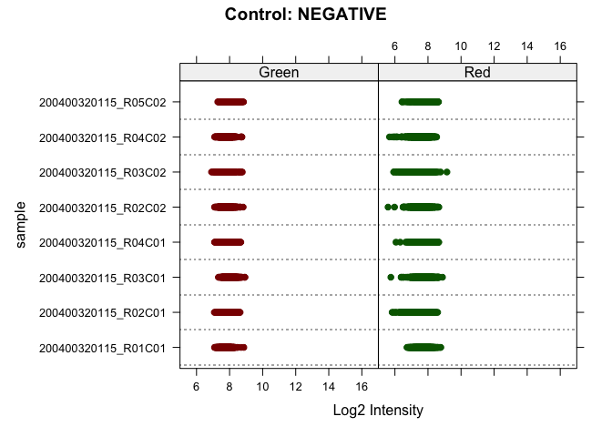
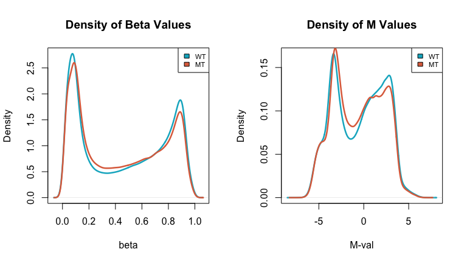
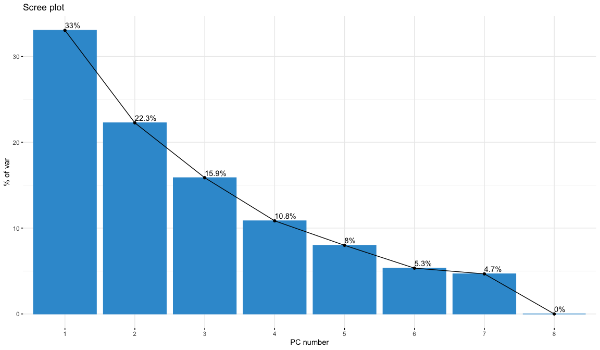
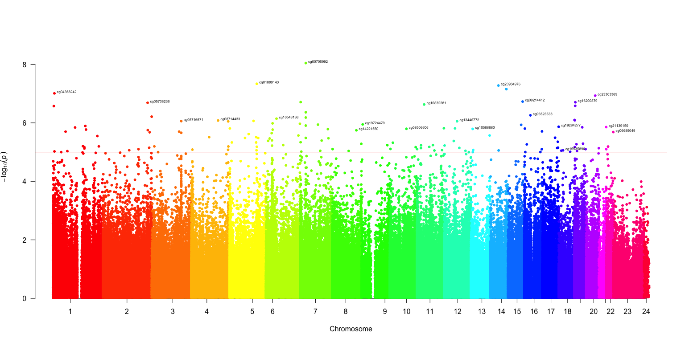
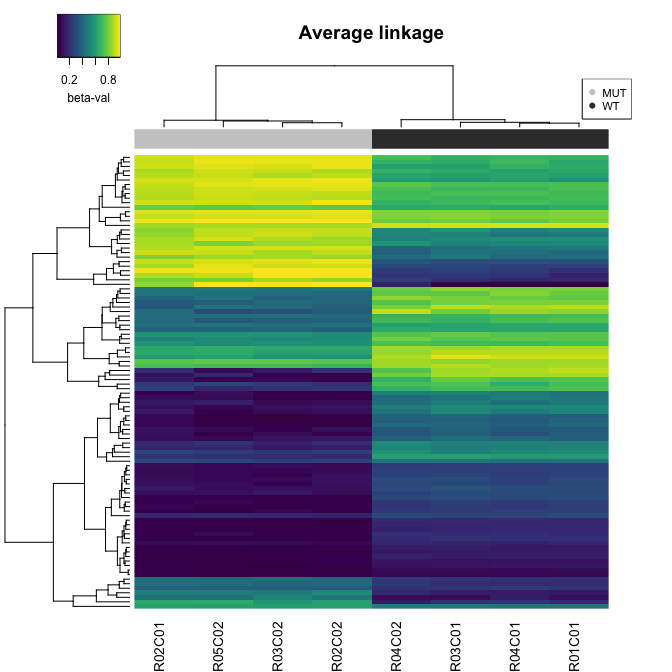

DRD project
================
**Mario Esposito**
28-Jun-2023

- <a href="#1-load-raw-data" id="toc-1-load-raw-data">1. Load raw data</a>
- <a href="#2-create-rg-dataframes" id="toc-2-create-rg-dataframes">2.
  Create R/G dataframes</a>
- <a href="#3-get-probe-info" id="toc-3-get-probe-info">3. Get probe
  info</a>
- <a href="#4-create-the-object-mset" id="toc-4-create-the-object-mset">4.
  Create the object MSet</a>
- <a href="#5-qc" id="toc-5-qc">5. QC</a>
- <a href="#6-beta-and-m-values" id="toc-6-beta-and-m-values">6. Beta and
  M-values</a>
- <a href="#7-normalization" id="toc-7-normalization">7. Normalization</a>
- <a href="#8-pca" id="toc-8-pca">8. PCA</a>
- <a href="#9-differentially-methylated-probes"
  id="toc-9-differentially-methylated-probes">9. Differentially methylated
  probes</a>
- <a href="#10-multiple-test-correction"
  id="toc-10-multiple-test-correction">10. Multiple test correction</a>
- <a href="#11-volcano-and-manhattan-plot"
  id="toc-11-volcano-and-manhattan-plot">11. Volcano and Manhattan
  plot</a>
- <a href="#12-heatmap" id="toc-12-heatmap">12. Heatmap</a>

------------------------------------------------------------------------

## 1. Load raw data

Load raw data with minfi and create an object called RGset storing the
RGChannelSet object

``` r
rm(list=ls())
library(minfi)
setwd('/Users/marius/prj/unibo/DRD/R/prj/')
baseDir <- ("Input/")
targets <- read.metharray.sheet(baseDir)
```

    ## [1] "Input//Samplesheet_report_2023.csv"

``` r
RGset <- read.metharray.exp(targets = targets)
```

## 2. Create R/G dataframes

Create the dataframes *Red* and *Green* to store the red and green
fluorescences respectively

``` r
Red <- data.frame(getRed(RGset))
head(Red)
```

<div data-pagedtable="false">

<script data-pagedtable-source type="application/json">
{"columns":[{"label":[""],"name":["_rn_"],"type":[""],"align":["left"]},{"label":["X200400320115_R01C01"],"name":[1],"type":["int"],"align":["right"]},{"label":["X200400320115_R02C01"],"name":[2],"type":["int"],"align":["right"]},{"label":["X200400320115_R03C01"],"name":[3],"type":["int"],"align":["right"]},{"label":["X200400320115_R04C01"],"name":[4],"type":["int"],"align":["right"]},{"label":["X200400320115_R02C02"],"name":[5],"type":["int"],"align":["right"]},{"label":["X200400320115_R03C02"],"name":[6],"type":["int"],"align":["right"]},{"label":["X200400320115_R04C02"],"name":[7],"type":["int"],"align":["right"]},{"label":["X200400320115_R05C02"],"name":[8],"type":["int"],"align":["right"]}],"data":[{"1":"591","2":"742","3":"613","4":"577","5":"592","6":"637","7":"812","8":"700","_rn_":"10600313"},{"1":"4140","2":"4154","3":"4553","4":"3965","5":"3248","6":"3933","7":"5749","8":"7030","_rn_":"10600322"},{"1":"6535","2":"6250","3":"6223","4":"6208","5":"6154","6":"6301","7":"6129","8":"5731","_rn_":"10600328"},{"1":"15752","2":"15110","3":"16277","4":"15746","5":"13907","6":"15217","7":"14955","8":"15061","_rn_":"10600336"},{"1":"597","2":"1027","3":"624","4":"742","5":"529","6":"458","7":"1674","8":"393","_rn_":"10600345"},{"1":"1464","2":"1381","3":"1863","4":"1593","5":"1591","6":"1584","7":"1649","8":"1237","_rn_":"10600353"}],"options":{"columns":{"min":{},"max":[10]},"rows":{"min":[10],"max":[10]},"pages":{}}}
  </script>

</div>

``` r
Green <- data.frame(getGreen(RGset))
head(Green)
```

<div data-pagedtable="false">

<script data-pagedtable-source type="application/json">
{"columns":[{"label":[""],"name":["_rn_"],"type":[""],"align":["left"]},{"label":["X200400320115_R01C01"],"name":[1],"type":["int"],"align":["right"]},{"label":["X200400320115_R02C01"],"name":[2],"type":["int"],"align":["right"]},{"label":["X200400320115_R03C01"],"name":[3],"type":["int"],"align":["right"]},{"label":["X200400320115_R04C01"],"name":[4],"type":["int"],"align":["right"]},{"label":["X200400320115_R02C02"],"name":[5],"type":["int"],"align":["right"]},{"label":["X200400320115_R03C02"],"name":[6],"type":["int"],"align":["right"]},{"label":["X200400320115_R04C02"],"name":[7],"type":["int"],"align":["right"]},{"label":["X200400320115_R05C02"],"name":[8],"type":["int"],"align":["right"]}],"data":[{"1":"289","2":"390","3":"408","4":"360","5":"337","6":"431","7":"428","8":"379","_rn_":"10600313"},{"1":"7070","2":"9820","3":"9225","4":"8324","5":"8910","6":"9553","7":"7285","8":"7154","_rn_":"10600322"},{"1":"6421","2":"7184","3":"6963","4":"7171","5":"6836","6":"6522","7":"7554","8":"6933","_rn_":"10600328"},{"1":"1571","2":"1467","3":"1526","4":"1864","5":"1620","6":"1496","7":"1602","8":"3729","_rn_":"10600336"},{"1":"5692","2":"6353","3":"7518","4":"6360","5":"6418","6":"6805","7":"6566","8":"4261","_rn_":"10600345"},{"1":"4280","2":"4824","3":"5346","4":"4373","5":"5110","6":"4774","7":"5290","8":"4087","_rn_":"10600353"}],"options":{"columns":{"min":{},"max":[10]},"rows":{"min":[10],"max":[10]},"pages":{}}}
  </script>

</div>

## 3. Get probe info

Get the Red and Green fluorescences for the address: 10737353, and check
in the manifest file if the address corresponds to a Type I or a Type II
probe.

``` r
probe_red <- Red[rownames(Red)=="10737353",]
probe_green <- Green[rownames(Green)=="10737353",]
load('Illumina450Manifest_clean.RData')
Illumina450Manifest_clean[Illumina450Manifest_clean$AddressA_ID=="10737353", 'Infinium_Design_Type']
```

    ## [1] II
    ## Levels: I II

``` r
address_df=data.frame(Sample=colnames(probe_green), Red=unlist(probe_red, use.names = FALSE), Green=unlist(probe_green, use.names = FALSE),Type='II',Color='both')
address_df
```

<div data-pagedtable="false">

<script data-pagedtable-source type="application/json">
{"columns":[{"label":["Sample"],"name":[1],"type":["chr"],"align":["left"]},{"label":["Red"],"name":[2],"type":["int"],"align":["right"]},{"label":["Green"],"name":[3],"type":["int"],"align":["right"]},{"label":["Type"],"name":[4],"type":["chr"],"align":["left"]},{"label":["Color"],"name":[5],"type":["chr"],"align":["left"]}],"data":[{"1":"X200400320115_R01C01","2":"4732","3":"2234","4":"II","5":"both"},{"1":"X200400320115_R02C01","2":"4508","3":"3190","4":"II","5":"both"},{"1":"X200400320115_R03C01","2":"4975","3":"2711","4":"II","5":"both"},{"1":"X200400320115_R04C01","2":"4178","3":"2498","4":"II","5":"both"},{"1":"X200400320115_R02C02","2":"3140","3":"800","4":"II","5":"both"},{"1":"X200400320115_R03C02","2":"2671","3":"1597","4":"II","5":"both"},{"1":"X200400320115_R04C02","2":"4184","3":"2824","4":"II","5":"both"},{"1":"X200400320115_R05C02","2":"1733","3":"1401","4":"II","5":"both"}],"options":{"columns":{"min":{},"max":[10]},"rows":{"min":[10],"max":[10]},"pages":{}}}
  </script>

</div>

## 4. Create the object MSet

``` r
MSet.raw <- preprocessRaw(RGset)
dim(MSet.raw)
```

    ## [1] 485512      8

## 5. QC

### 5.1 QCPlot

In a QCplot, the medians from the methylation signal and unmethylation
signal distributions are plotted. Data of good quality are found at high
values of median for both the methylated and unmethylated signals; at
contrary, low values of median indicate a lower quality of data.

Two limitations of the QC plot: *Not taking into account the background
signal* Not taking into account whether some failure happens during the
sample preparation: you still have high signal but it can be evaluated
using control probes

``` r
qc <- getQC(MSet.raw)
qc
```

    ## DataFrame with 8 rows and 2 columns
    ##                          mMed      uMed
    ##                     <numeric> <numeric>
    ## 200400320115_R01C01   11.4236   12.1049
    ## 200400320115_R02C01   11.6221   12.2085
    ## 200400320115_R03C01   11.6931   12.1341
    ## 200400320115_R04C01   11.5372   12.0941
    ## 200400320115_R02C02   11.2076   12.1920
    ## 200400320115_R03C02   11.3750   12.2935
    ## 200400320115_R04C02   11.6348   12.1170
    ## 200400320115_R05C02   11.2015   12.0536

``` r
plotQC(qc)
```


*In the QCplot is clear that all the samples have a good median for both
methylated and unmethylated signals*

### 5.2 Negative controls

Check the intensity of **negative controls** (log intensity should be
lower than 10). Illumina suggests a range of 100-1000 intensity units.
Over 1000 the sample is affected by some issues, for example it’s likely
that the original DNA was degraded, with a loss of specificity.

``` r
controlStripPlot(RGset, controls="NEGATIVE",xlim = c(5,10))
```



*In both Green and Red channels the log intensities of negative controls
are below 10, thus the background signal is in the acceptable range.*

### 5.3 Detection P val

Check how many probes have a detection p-value higher than 0.05
(**failed probes**). These probes shows a signal m+u not significantly
higher than the background signal, thus they should be considered as bad
probes.

``` r
detP <- detectionP(RGset) 
failed <- detP>0.05
cols <- vector()
for(i in 1:ncol(failed)){cols[i] <- length(failed[failed[,i] ==TRUE ,i])}
summary_df <- data.frame(Sample=colnames(failed),Num_failed_position=cols,percentage=colMeans(failed)*100,row.names = NULL)
summary_df
```

<div data-pagedtable="false">

<script data-pagedtable-source type="application/json">
{"columns":[{"label":["Sample"],"name":[1],"type":["chr"],"align":["left"]},{"label":["Num_failed_position"],"name":[2],"type":["int"],"align":["right"]},{"label":["percentage"],"name":[3],"type":["dbl"],"align":["right"]}],"data":[{"1":"200400320115_R01C01","2":"45","3":"0.009268566"},{"1":"200400320115_R02C01","2":"26","3":"0.005355171"},{"1":"200400320115_R03C01","2":"28","3":"0.005767108"},{"1":"200400320115_R04C01","2":"32","3":"0.006590980"},{"1":"200400320115_R02C02","2":"190","3":"0.039133945"},{"1":"200400320115_R03C02","2":"130","3":"0.026775857"},{"1":"200400320115_R04C02","2":"17","3":"0.003501458"},{"1":"200400320115_R05C02","2":"406","3":"0.083623062"}],"options":{"columns":{"min":{},"max":[10]},"rows":{"min":[10],"max":[10]},"pages":{}}}
  </script>

</div>

*All samples has a percentage of failed probes lower than 1%, so we can
keep all of them. (It would be an option to filter in only the probes
failed in less than a certain percentage of samples.)*

## 6. Beta and M-values

Calculate raw beta and M values and plot the densities of mean
methylation values, dividing the samples in WT and MUT. Check
differences between the 2 groups.

``` r
wt <- targets[targets$Group=="WT", "Basename"]
mt <- targets[targets$Group=="MUT", "Basename"]
wt <- gsub(baseDir, "", wt) 
mt <- gsub(baseDir, "", mt) 

wt_subset <- MSet.raw[,colnames(MSet.raw) %in% wt]
mt_subset <- MSet.raw[,colnames(MSet.raw) %in% mt]

wtBeta <- getBeta(wt_subset)
wtM <- getM(wt_subset)
mtBeta <- getBeta(mt_subset)
mtM <- getM(mt_subset)

density_wtBeta <- density(apply(wtBeta,MARGIN=1,mean,na.rm=T),na.rm=T)
density_mtBeta <- density(apply(mtBeta,MARGIN=1,mean,na.rm=T),na.rm=T)
density_wtM <- density(apply(wtM,MARGIN=1,mean,na.rm=T),na.rm=T)
density_mtM <- density(apply(mtM,MARGIN=1,mean,na.rm=T),na.rm=T)
```

``` r
par(mfrow=c(1,2))
#beta density MT vs WT

plot(density_wtBeta,main="Density of Beta Values",col="#03B2C9",lwd=2.5)
lines(density_mtBeta,main="Density of Beta Values",col="#DE6E4B",lwd=2.5)
legend('topright', legend=c("WT","MT"), fill = c("#03B2C9","#DE6E4B"),cex=0.7)
#M-vlaue density MT vs WT
plot(density_wtM,main="Density of M Values",col="#03B2C9",lwd=2.5)
lines(density_mtM,main="Density of M Values",col="#DE6E4B",lwd=2.5)
legend('topright', legend=c("WT","MT"), fill = c("#03B2C9","#DE6E4B"),cex = 0.7)
```



*Looking at the WT and MUT distributions they seems **very similar**. It
is possible to notice that the WT peaks in beta-val distribution are
slightly higher than MUT, while in the middle the WT distribution is
slightly lower. The M-values distribution reflects the same
differences.*

## 7. Normalization

Normalize the data using the function preprocessNoob and compare raw
data and normalized data. Produce a plot with 6 panels in which, for
both raw and normalized data, you show the density plots of beta mean
values according to the chemistry of the probes, the density plot of
beta standard deviation values according to the chemistry of the probes
and the boxplot of beta values.

**Noob** performs within-array normalization correcting for background
fluorescence and dye bias. It fits a normal-exponential convolution
model to estimate the true signal conditional on the observed
intensities, capitalizing on the unique design of the Infinium I probe
pairs to estimate non-specific signal from the ‘out-of-band’
intensities, the wavelength in the opposite color channel to their
design. These background-corrected intensities are then normalized for
variation in average intensity in the red and green channel via a
multiplicative scale factor computed using the average intensities of
the positive control probes.

``` r
dfI <- Illumina450Manifest_clean[Illumina450Manifest_clean$Infinium_Design_Type=="I",]
dfI <- droplevels(dfI)
dfII <- Illumina450Manifest_clean[Illumina450Manifest_clean$Infinium_Design_Type=="II",]
dfII <- droplevels(dfII)
#get beta for infinium I and II
beta <- getBeta(MSet.raw)
beta_I <- beta[rownames(beta) %in% dfI$IlmnID,]
beta_II <- beta[rownames(beta) %in% dfII$IlmnID,]
#raw mean
density_mean_beta_I <- density(apply(beta_I,1,mean,na.rm=T),na.rm=T)
density_mean_beta_II <- density(apply(beta_II,1,mean,na.rm=T),na.rm=T)
#raw sd
density_sd_of_beta_I <- density(apply(beta_I,1,sd,na.rm=T),na.rm=T)
density_sd_of_beta_II <- density(apply(beta_II,1,sd,na.rm=T),na.rm=T)
#apply Noob normalization
RGSet_Noob <- preprocessNoob(RGset)
#get beta for Infinium I and II
beta_Noob <- getBeta(RGSet_Noob)
beta_I_Noob <- beta[rownames(beta_Noob) %in% dfI$IlmnID,]
beta_II_Noob <- beta[rownames(beta_Noob) %in% dfII$IlmnID,]
#Noob mean
density_mean_beta_I_Noob <- density(apply(beta_I_Noob,1,mean,na.rm=T),na.rm=T)
density_mean_beta_II_Noob <- density(apply(beta_II_Noob,1,mean,na.rm=T),na.rm=T)
#Noob sd
density_sd_of_beta_I_Noob <- density(apply(beta_I_Noob,1,sd,na.rm=T),na.rm=T)
density_sd_of_beta_II_Noob <- density(apply(beta_II_Noob,1,sd,na.rm=T),na.rm=T)
```

``` r
#plot
par(mfrow=c(2,3))
plot(density_mean_beta_I,col="#003554",main="raw beta",lwd=3.0)
lines(density_mean_beta_II,col="#D95CFF",lwd=3.0)
legend('topright', legend=c("Type I","Type II"), fill = c("#003554","#D95CFF"))

plot(density_sd_of_beta_I,col="#003554",main="raw sd",lwd=3.0)
lines(density_sd_of_beta_II,col="#D95CFF",lwd=3.0)
###
group_color = c()
i = 1
for (name in colnames(beta)){
  if (name %in% wt){group_color[i]="#03B2C9"}
  else{group_color[i]="#DE6E4B"}
  i = i+1
}

boxplot(beta,col=group_color,border="#343434",names=NA,main="raw beta distribution by Sample")

plot(density_mean_beta_I_Noob,col="#003554",main="preprocessNoob beta",lwd=3.0)
lines(density_mean_beta_II_Noob,col="#D95CFF",lwd=3.0)

plot(density_sd_of_beta_I_Noob,col="#003554",main="preprocessNoob sd",lwd=3.0)
lines(density_sd_of_beta_II_Noob,col="#D95CFF",lwd=3.0)

boxplot(beta_Noob,col=group_color,border="#343434",names=NA,main="preprocessNoob beta distribution by Sample")
```


*The Noob has produced very small changes(e.g., notice the beta medians
difference of boxplot 1 and 2), furthermore, all the median and Q1 have
been shifted to lower value after the normalization.* *Looking at
difference in the distribution between WT(light blue) and MUT(red), it
seems that 3/4 MUT have lower median and Q3 compared to WT. This is true
for both raw and normalized beta*

## 8. PCA

Perform a PCA on the matrix of normalized beta values generated in step
7. Check how samples cluster by Sex or Group. (All the samples belong to
the same batch (Sentrix_ID))

``` r
pca_results <- prcomp(t(beta_Noob),scale=T)

library(factoextra)
fviz_eig(pca_results, addlabels = T,xlab='PC number',ylab='% of var', barfill = "#369AD3", barcolor = "#369AD3")
```


``` r
par(mfrow=c(1,1))
targets$Group<- as.factor(targets$Group)
palette(c("#DE6E4B","#03B2C9"))
plot(pca_results$x[,1],pca_results$x[,2],cex=1.5,pch=19,col=targets$Group,xlab="PC1(33%)",ylab="PC2(22.3%)",xlim=c(-750,750),ylim=c(-750,750),main='PCA (Group)')
text(pca_results$x[,1],pca_results$x[,2],labels=rownames(pca_results$x),cex=0.6,pos=2)
legend("topright", legend=levels(targets$Group),col=c(1,2),pch = 19,cex=1.5)
```



``` r
targets$Sex<- as.factor(targets$Sex)
palette(c("#F07168","#B7F4F8"))
plot(pca_results$x[,1],pca_results$x[,2],cex=1.5,pch=19,col=targets$Sex,xlab="PC1(33%)",ylab="PC2(22.3%)",xlim=c(-750,750),ylim=c(-750,750),main='PCA (Sex)')
text(pca_results$x[,1],pca_results$x[,2],labels=rownames(pca_results$x),cex=0.6,pos=2)
legend("topright", legend=levels(targets$Sex),col=c(1,2),pch = 19,cex=1.5)
```


*PCA by group: all the WT are closer each other while only 2 MUT cluster
together (bottom right), 1 MUT cluster with WT and 1 MUT is located on
top right ,* *PCA by Sex: all 3 Males are close to each other while the
5 Females are separated in 3 spots*

## 9. Differentially methylated probes

Using the matrix of normalized beta values generated in step 7, identify
differentially methylated probes between group WT and group MUT using a
**t-test**.

``` r
library(future.apply)
plan(multisession)
My_t_test <- function(x) {
  t_test <- t.test(x ~ targets$Group)
  return(t_test$p.value)} 
p_values <- future_apply(beta_Noob, 1, My_t_test)
final_ttest <- data.frame(beta_Noob,t_test_p_val = p_values)
final_ttest <- final_ttest[order(final_ttest$t_test_p_val),]
hist(final_ttest$t_test_p_val, main="P-value distribution (t-test)",xlab='p-val')
abline(v=0.05,col="#ef233c")
```


## 10. Multiple test correction

Apply multiple test correction and set a significant threshold of 0.05.
Check how many probes do you identify as differentially methylated
considering nominal pValues; how many after Bonferroni correction; how
many after BH correction?

``` r
final_ttest_0.05 <- final_ttest[final_ttest$t_test_p_val <= 0.05,]
corr_pValues_BH <- p.adjust(final_ttest$t_test_p_val,"BH")
corr_pValues_bonferroni <- p.adjust(final_ttest$t_test_p_val,"bonferroni")
final_ttest_corr <- data.frame(final_ttest,corr_pValues_BH,corr_pValues_bonferroni)
colMeans(final_ttest_corr[,9:11]<0.05)*nrow(final_ttest_corr)
```

    ##            t_test_p_val         corr_pValues_BH corr_pValues_bonferroni 
    ##                   63437                     213                       5

*As expected Bonferroni which is more stringent than BH resulted in only
5 significant probes*

``` r
boxplot(final_ttest_corr[,9:11], ylim = c(-0.1, 1.1), col = c("#1D2322", "#CD523C", "#87DFD6"),names=NA,main='p-val before/after corrections')
legend("topright", legend=c("raw", "BH", "Bonferroni"),col=c("#1D2322", "#CD523C", "#87DFD6"),pch=19, cex=0.5, xpd=TRUE)
```


## 11. Volcano and Manhattan plot

Produce a volcano plot and a Manhattan plot of the results of
differential methylation analysis.

``` r
# WT group mean
WT_group_mean <- apply(final_ttest[,targets$Group=="WT"], 1, mean)
# MUT group mean
MUT_group_mean <- apply(final_ttest[,targets$Group=="MUT"], 1, mean)
# Compute delta between the means
delta <- MUT_group_mean - WT_group_mean
BH_sig<-final_ttest_corr[10]<0.05
toVolcPlot <- data.frame(delta,'minus_log10_p_val'= -log10(final_ttest_corr$t_test_p_val),BH_sig)
```

``` r
plot(toVolcPlot[,1], toVolcPlot[,2],pch=16,cex=0.4,col='#1D2322',xlab='Δμ_beta(MUT-WT)',ylab='-log10 p',xlim=c(-1,1))
abline(h=-log10(0.05))
nominal_sig <- toVolcPlot[abs(toVolcPlot[,1])>0.1 & toVolcPlot[,2]>(-log10(0.05)),]
BH_sig <- toVolcPlot[abs(toVolcPlot[,1])>0.1 & toVolcPlot[,3]==T,]
points(nominal_sig[,1], nominal_sig[,2],pch=16,cex=0.4,col="#324946")
points(BH_sig[,1], BH_sig[,2],pch=19,cex=0.6,col="#CD523C")
legend("topright", legend=c("not_significant", "p_val < 0.05", "BH_p_val <  0.05"),col=c("#1D2322", "#324946", "#CD523C"),pch = 19)
```


``` r
#
```

``` r
final_ttest_corr_anno <-data.frame(rownames(final_ttest_corr),final_ttest_corr)
colnames(final_ttest_corr_anno)[1] <- "IlmnID"
final_ttest_corr_anno <- merge(final_ttest_corr_anno, Illumina450Manifest_clean,by="IlmnID")
input_Manhattan <- data.frame(ID=final_ttest_corr_anno$IlmnID,CHR=final_ttest_corr_anno$CHR, MAPINFO=final_ttest_corr_anno$MAPINFO, PVAL=final_ttest_corr_anno$t_test_p_val)
head(input_Manhattan)
```

<div data-pagedtable="false">

<script data-pagedtable-source type="application/json">
{"columns":[{"label":[""],"name":["_rn_"],"type":[""],"align":["left"]},{"label":["ID"],"name":[1],"type":["chr"],"align":["left"]},{"label":["CHR"],"name":[2],"type":["fct"],"align":["left"]},{"label":["MAPINFO"],"name":[3],"type":["int"],"align":["right"]},{"label":["PVAL"],"name":[4],"type":["dbl"],"align":["right"]}],"data":[{"1":"cg00000029","2":"16","3":"53468112","4":"0.03969214","_rn_":"1"},{"1":"cg00000108","2":"3","3":"37459206","4":"0.07100667","_rn_":"2"},{"1":"cg00000109","2":"3","3":"171916037","4":"0.04089225","_rn_":"3"},{"1":"cg00000165","2":"1","3":"91194674","4":"0.15398812","_rn_":"4"},{"1":"cg00000236","2":"8","3":"42263294","4":"0.39595545","_rn_":"5"},{"1":"cg00000289","2":"14","3":"69341139","4":"0.73450195","_rn_":"6"}],"options":{"columns":{"min":{},"max":[10]},"rows":{"min":[10],"max":[10]},"pages":{}}}
  </script>

</div>

``` r
levels(input_Manhattan$CHR)[levels(input_Manhattan$CHR) == "X"] <- "23"               
levels(input_Manhattan$CHR)[levels(input_Manhattan$CHR) == "Y"] <- "24"              
input_Manhattan$CHR <- as.numeric(as.character(input_Manhattan$CHR))
```

``` r
library(qqman)
manhattan(input_Manhattan, snp="ID",chr="CHR", bp="MAPINFO", p="PVAL",annotatePval = 0.00001,col=rainbow(24),suggestiveline=F,genomewideline=-log10(0.00001) )
```



## 12. Heatmap

Produce an heatmap of the top 100 differentially methylated probes
adopting 3 different linkage methods:

*Complete* Average

``` r
library(gplots)
library(viridis)
input_heatmap=as.matrix(final_ttest[1:100,1:8])

group_color = c()
i = 1
for (name in colnames(beta)){
  if (name %in% wt){group_color[i]="#393939"}
  else{group_color[i]="#CBCBCB"}
  i = i+1
}
```

#### Linkage methods-\> Complete

``` r
col_pal=colorRampPalette(c("#29A6AD","#FAB319"))(100)
heatmap.2(input_heatmap,col=viridis(100),Rowv=T,Colv=T,dendrogram="both",key=T,ColSideColors=group_color,density.info="none",trace="none",scale="none",symm=F,main="Complete linkage",key.xlab='beta-val',key.title=NA,keysize=1,labRow=NA)
legend("topright", legend=levels(targets$Group),col=c('#CBCBCB','#393939'),pch = 19,cex=0.7)
```


#### Linkage methods-\> Single

``` r
## Single
heatmap.2(input_heatmap,col=viridis(100),Rowv=T,Colv=T,hclustfun = function(x) hclust(x,method = 'single'),dendrogram="both",key=T,ColSideColors=group_color,density.info="none",trace="none",scale="none",symm=F,main="Single linkage",key.xlab='beta-val',key.title=NA,keysize=1,labRow=NA)
legend("topright", legend=levels(targets$Group),col=c('#CBCBCB','#393939'),pch = 19,cex=0.7)
```


#### Linkage methods-\> Average

``` r
heatmap.2(input_heatmap,col=viridis(100),Rowv=T,Colv=T,hclustfun = function(x) hclust(x,method = 'average'),dendrogram="both",key=T,ColSideColors=group_color,density.info="none",trace="none",scale="none",symm=F,main="Average linkage",key.xlab='beta-val',key.title=NA,keysize=1,labRow=NA)
legend("topright", legend=levels(targets$Group),col=c('#CBCBCB','#393939'),pch = 19,cex=0.7)
```


